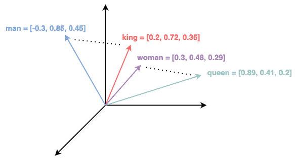

# Desafíos de Procesamiento de Lenguaje Natural (NLP)


Este repositorio contiene la implementación de dos desafíos relacionados con técnicas de Procesamiento de Lenguaje Natural (NLP). Cada desafío tiene como objetivo la aplicación de métodos de clasificación de texto y la generación de embeddings personalizados.

## Desafío 1: Clasificación de Texto con Naïve Bayes y el Dataset 20 Newsgroups


### Descripción
En este desafío, se implementa un modelo de clasificación de textos utilizando el famoso dataset 20 Newsgroups. Se comparan dos técnicas de vectorización de texto: Bag of Words (`CountVectorizer`) y TF-IDF (`TfidfVectorizer`), para luego aplicar el algoritmo de Naïve Bayes y evaluar su rendimiento.

### Pasos:
1. **Preprocesamiento de datos:** Se descargan los datos de 20 Newsgroups y se realiza su limpieza.
2. **Vectorización del texto:** Se utilizan `CountVectorizer` y `TfidfVectorizer` para transformar los textos en vectores.
3. **Entrenamiento del modelo:** Se entrena un modelo de Naïve Bayes (`MultinomialNB` y `ComplementNB`).
4. **Evaluación:** Se evalúa el rendimiento del modelo usando la métrica `f1_score`.

### Resultados
El modelo de Naïve Bayes es evaluado sobre los vectores generados, y se observan diferencias en el rendimiento dependiendo de si se utiliza Bag of Words o TF-IDF para la representación del texto.

---

## Desafío 2: Creación de Embeddings Personalizados con Gensim

<p align="center">
  
</p>

### Descripción
Este desafío se centra en la generación de embeddings de palabras personalizados utilizando el corpus de letras de canciones en inglés. Se emplea el modelo `Word2Vec` de Gensim para capturar las relaciones semánticas entre las palabras dentro del corpus.

### Pasos:
1. **Preprocesamiento del corpus:** Limpieza y tokenización de las letras de canciones.
2. **Entrenamiento de Word2Vec:** Se entrena un modelo `Word2Vec` para generar los embeddings de palabras.
3. **Evaluación:** Se consulta la similitud de palabras para verificar la calidad de los embeddings generados.

### Resultados
Los embeddings generados reflejan el contexto y las relaciones semánticas dentro de las letras de canciones, permitiendo realizar consultas sobre la similitud entre palabras.

---

## Desafío 3: Modelado de Lenguaje con Redes Neuronales Recurrentes

<p align="center">
  
</p>
### Parte 1: Dataset de Canciones (The Beatles y Jimi Hendrix)

1. **Preparación de Datos:**
   - Selección de un corpus de texto (canciones de The Beatles y Jimi Hendrix).
   - Limpieza y tokenización del corpus.
   - Estructuración del dataset y separación en datos de entrenamiento y validación.

2. **Preprocesamiento:**
   - Conversión de palabras en números mediante tokenización.
   - Creación de diccionarios para mapear palabras a índices y viceversa.
   - Ajuste de las secuencias a una longitud fija mediante padding.

3. **Arquitectura del Modelo:**
   - Propuesta de redes neuronales recurrentes basadas en unidades como **SimpleRNN**, **LSTM**, y **GRU**.
   - Construcción de un modelo de lenguaje para predecir nuevas secuencias de texto.

4. **Generación de Secuencias:**
   - Utilización de **greedy search** y **beam search** (determinístico y estocástico) para generar secuencias a partir de secuencias de contexto.
   - Observación del impacto de la temperatura en la generación de secuencias estocásticas.

5. **Entrenamiento del Modelo:**
   - Optimización del modelo utilizando el optimizador **rmsprop** para garantizar una buena convergencia.
   - Uso del descenso de la **perplejidad** en los datos de validación como métrica para finalizar el entrenamiento (con un callback provisto).

---

### Parte 2: Corpus de Roberto Arlt ("El crimen casi perfecto")

1. **Preparación de Datos:**
   - Selección de un corpus literario (libro de Roberto Arlt, "El crimen casi perfecto").
   - Limpieza y tokenización del corpus.
   - Estructuración del dataset y separación en datos de entrenamiento y validación.

2. **Preprocesamiento:**
   - Conversión de palabras en números mediante tokenización.
   - Creación de diccionarios para mapear palabras a índices y viceversa.
   - Ajuste de las secuencias a una longitud fija mediante padding.

3. **Arquitectura del Modelo:**
   - Propuesta de redes neuronales recurrentes basadas en unidades como **SimpleRNN**, **LSTM**, y **GRU**.
   - Construcción de un modelo de lenguaje para predecir nuevas secuencias de texto.

4. **Generación de Secuencias:**
   - Utilización de **greedy search** y **beam search** (determinístico y estocástico) para generar secuencias a partir de secuencias de contexto.
   - Observación del impacto de la temperatura en la generación de secuencias estocásticas.

5. **Entrenamiento del Modelo:**
   - Optimización del modelo utilizando el optimizador **rmsprop** para garantizar una buena convergencia.
   - Uso del descenso de la **perplejidad** en los datos de validación como métrica para finalizar el entrenamiento (con un callback provisto).

---

### Funcionamiento General
En ambas partes, el modelo utiliza una arquitectura de red recurrente para entrenar un modelo de lenguaje. La secuencia de contexto es procesada y transformada en una nueva secuencia de texto, donde se exploran estrategias de búsqueda y el ajuste de la temperatura para generar resultados más coherentes.

---

### Resumen:
Este desafío implementa un modelo de lenguaje utilizando diversas arquitecturas de redes neuronales recurrentes (SimpleRNN, LSTM y GRU). A partir de corpus textuales (canciones de The Beatles y Jimi Hendrix en la Parte 1, y un libro de Roberto Arlt en la Parte 2), se generan nuevas secuencias de texto con métodos como **greedy search** y **beam search**. Se optimiza el entrenamiento utilizando **rmsprop** y se evalúa el rendimiento con la métrica de **perplejidad**.


---

## Desafío 4: Simulador de Conversaciones de Chatbot

<p align="center">
  
</p>
### Descripción
Este código implementa un chatbot básico utilizando un modelo de secuencia a secuencia (seq2seq) con una arquitectura de codificador-decodificador. El objetivo es simular conversaciones entrenando un modelo de aprendizaje profundo para predecir respuestas basadas en una entrada de texto.

### Pasos:

1. **Preparación de Datos:**
   - Carga de datos de conversaciones desde un archivo JSON.
   - Limpieza y preprocesamiento del texto.
   - División de las conversaciones en pares de pregunta-respuesta.

2. **Preprocesamiento:**
   - **Tokenización:** Conversión de palabras en números para que la máquina las entienda.
   - **Padding:** Ajuste de las secuencias a una longitud fija para facilitar el procesamiento.
   - Creación de diccionarios para mapear palabras a índices y viceversa.

3. **Embeddings:**
   - Carga de embeddings preentrenados (Glove) para representar palabras como vectores numéricos.
   - Creación de una matriz de embeddings para el vocabulario del dataset.

4. **Entrenamiento del Modelo:**
   - Construcción de un modelo seq2seq con capas LSTM.
   - Entrenamiento del modelo para predecir la respuesta siguiente dada una pregunta.

5. **Inferencia:**
   - Creación de modelos separados para el codificador y el decodificador para la inferencia.
   - Función para generar una respuesta dada una entrada.

### Funcionamiento General:
- El modelo codifica la pregunta de entrada en un vector de estado.
- El decodificador utiliza este vector de estado para generar una respuesta palabra por palabra.
- El proceso continúa hasta que se genera una palabra de fin de secuencia o se alcanza una longitud máxima.

### Resumen:
Este código entrena un modelo de aprendizaje profundo para simular conversaciones. Puede utilizarse como base para construir chatbots más sofisticados.

---

## Desafío 5: Análisis de Sentimiento con BERT


### 1. Preparación de Datos:
   - Carga de un conjunto de datos de reseñas de aplicaciones.
   - Limpieza y preprocesamiento del texto, incluyendo la tokenización con el tokenizador de BERT.
   - Creación de conjuntos de entrenamiento y evaluación para estructurar los datos de forma adecuada.

### 2. Construcción del Modelo:
   - Uso de la arquitectura BERT preentrenada como base para el análisis de sentimiento.
   - Adición de capas densas sobre la salida de BERT para realizar la clasificación multiclase (sentimientos positivos, negativos y neutrales).

### 3. Entrenamiento:
   - Entrenamiento del modelo de clasificación sobre el conjunto de datos etiquetado.
   - Optimización con técnicas de regularización como el **dropout** para evitar el sobreajuste.
   - Uso del optimizador Adam con parámetros predefinidos para lograr una buena convergencia.

### 4. Evaluación:
   - Evaluación del modelo en un conjunto de datos de prueba.
   - Cálculo de métricas clave como la **precisión** y el **F1-score** para medir el rendimiento en la clasificación de los sentimientos.

### Funcionamiento General:
   El modelo utiliza la arquitectura **BERT preentrenada** para extraer representaciones semánticas profundas del texto. Estas representaciones son luego procesadas por capas densas para realizar la clasificación de las reseñas en categorías de sentimiento (positivo, negativo y neutral). La arquitectura permite aprovechar la capacidad de BERT para capturar el contexto y la relación entre palabras, mejorando la precisión del análisis de sentimiento.

---

### Resumen:
Este proyecto implementa un análisis de sentimiento utilizando BERT, un modelo de lenguaje preentrenado de última generación. El modelo fue entrenado sobre un conjunto de datos de reseñas de aplicaciones y mostró una precisión de [inserta el valor de precisión aquí], demostrando su capacidad para clasificar correctamente los sentimientos. Se entrenó utilizando **TensorFlow** y **Transformers**, y fue evaluado con métricas como precisión y F1-score.

---

## Requisitos

Para ejecutar los notebooks, asegúrate de instalar las siguientes dependencias:

```bash
pip install -r requirements.txt
